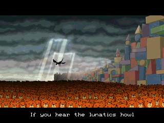
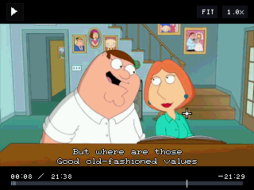
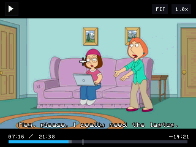

# Nspire-VideoPlayer-Ndless

Native Ndless video player and PC-side encoder for the TI-Nspire CX II line.

This project keeps the player and the movie data separate:

- `ndvideo.tns` is the Ndless launcher
- each movie is a streamed `.nvp` container stored on the calculator filesystem

The player has been tested on the **TI-Nspire CX II-T**.

## Screenshots

| Subtitle playback | UI overlay | Dialogue scene |
| --- | --- | --- |
|  |  |  |

## Features

- Native C/Ndless runtime, no ScriptApp resource packing and no giant embedded movie `.tns` payloads
- Streamed movie playback from calculator storage
- RGB565 video output
- Chunked container with keyframes, block deltas, motion reuse, and chunk-level zlib compression
- Incremental chunk prefetching and decompression to reduce playback stutter
- Accurate frame pacing with a hardware-backed monotonic timer
- Subtitle support for text subtitles stored in the `.nvp` container
- Subtitle controls:
  - 4 placement modes: bottom of screen, bottom of video, top of video, top of screen
  - 4 visible size levels plus hidden
  - built-in subtitle font cycling
  - temporary on-screen font-name preview when changing subtitle font
- Playback speed control from `0.25x` to `2.0x`
- Scale modes: `FIT`, `FILL`, `STRETCH`, `1:1`
- Bottom playback UI with:
  - current time / total time
  - negative time remaining
  - progress bar
  - prefetched chunk visualization
- Touchpad cursor support
- Seeking by touching anywhere inside the bottom UI band, not just the thin progress line
- In-player help overlay opened with `Catalog`
- Movie picker for browsing multiple `.nvp` / `.nvp.tns` files

## Current Limits

- No audio yet
- Subtitle rendering is text-only
- The runtime is tuned for low RAM usage and filesystem streaming, not full in-memory playback

## Controls

### Picker

- `Up` / `Down`: select movie
- `Enter`: open movie
- `Esc`: exit

### Playback

- `Enter`: play / pause
- touchpad click: play / pause, or seek when clicking inside the bottom UI band
- `Left` / `Right`: seek `-5s` / `+5s`
- `Tab`: single-frame step while paused
- `/`: cycle scale mode
- `{` / `}`: decrease / increase playback speed
- `^`: cycle subtitle placement
- `+` / `-`: increase / decrease subtitle size, down to hidden
- `F`: cycle subtitle font
- move the touchpad: show the cursor and reveal the UI
- `Catalog`: open / close the controls overlay
- `Esc`: close the controls overlay, or leave the movie if the overlay is not open

## Subtitle Fonts

The player can cycle through the built-in Ndless SDL bitmap fonts for subtitles:

- `Tinytype`
- `VGA`
- `Thin`
- `Space`
- `Fantasy`

These are built-in `nSDL` fonts. They are still bitmap fonts, not anti-aliased vector text.

## Repository Layout

- [`src/player.c`](./src/player.c): native player
- [`src/initfini.c`](./src/initfini.c): startup / shutdown glue
- [`tools/encode_ndless_video.py`](./tools/encode_ndless_video.py): PC-side encoder
- [`tools/pack_zehn.py`](./tools/pack_zehn.py): Zehn packer used by the build
- [`examples/screenshots`](./examples/screenshots): README screenshot assets
- [`examples`](./examples): sample packaged files, including a short example movie
- [`Makefile`](./Makefile): player build entry point

## Build

The build uses the official Ndless SDK for compile/link, and the repo-local packer instead of relying on the upstream host `genzehn` binary.

### Requirements

- official Ndless SDK cloned at `./external/Ndless/ndless-sdk`
- ARM GCC toolchain available, with `_NDLESS_TOOLCHAIN_PATH` pointing at its `bin` directory
- `make`
- `bash`
- `python`
- `pyelftools`

### Build Command

```bash
make
```

### Build Output

The build writes to [`dist`](./dist):

- `ndvideo.tns`: calculator launcher
- `ndvideo.elf`: native ARM ELF
- `ndvideo.zehn`: packed Zehn payload

The current build is packaged with:

- Ndless minimum version `4.5`
- hardware-accelerated / HWW support flag enabled
- no `lcd_blit` compatibility fallback flag

## Encoder

The encoder turns a normal video file into a streamed `.nvp` movie container for the player and writes it with a `.nvp.tns` filename by default.

### Python Requirements

Install the encoder dependencies with:

```bash
pip install imageio-ffmpeg numpy pillow
```

The encoder uses:

- `imageio-ffmpeg`
- `numpy`
- `Pillow`

### Encoder Features

- video resize / fit into the TI-Nspire canvas
- RGB565 conversion
- configurable target framerate or source-framerate preservation
- optional subtitle import:
  - external `.srt`
  - embedded subtitles extracted from the source file
- configurable block size, chunk size, keyframe cadence, motion search, posterization, and zlib level
- `.json` encode stats sidecar output

### Basic Encode Example

```powershell
python .\tools\encode_ndless_video.py "C:\path\to\video.mp4" --output ".\dist\video.nvp.tns"
```

### Encode With Embedded Subtitles

```powershell
python .\tools\encode_ndless_video.py "C:\path\to\video.mkv" --subtitle embedded --output ".\dist\video.nvp.tns"
```

### Preserve Source Framerate

```powershell
python .\tools\encode_ndless_video.py "C:\path\to\video.mkv" --subtitle embedded --fps source --output ".\dist\video.nvp.tns"
```

### Recommended Full-Episode Settings

This is the best quality-to-file-size balance I found for a full Family Guy episode on the CX II-T:

```powershell
python .\tools\encode_ndless_video.py "C:\path\to\episode.mkv" --subtitle embedded --output ".\dist\episode.nvp.tns" --fps 16 --max-width 320 --max-height 180 --chunk-frames 72 --block-size 16 --keyframe-interval 144 --change-ratio 0.08 --keyframe-block-ratio 0.75 --motion-search-radius 10 --motion-search-step 2 --motion-error-ratio 0.12 --posterize-bits 4 --zlib-level 9
```

There is also a ready-made short example encode in [`examples`](./examples) for quick testing without encoding a full episode first.

### Useful Encoder Options

- `--fps`
- `--max-width`
- `--max-height`
- `--block-size`
- `--chunk-frames`
- `--keyframe-interval`
- `--change-ratio`
- `--keyframe-block-ratio`
- `--motion-search-radius`
- `--motion-search-step`
- `--motion-error-ratio`
- `--posterize-bits`
- `--zlib-level`
- `--start`
- `--duration`

Run `python tools/encode_ndless_video.py --help` for the full CLI.

## Install On Calculator

1. Build `ndvideo.tns`.
2. Encode a movie into a `.nvp.tns` file.
3. Copy `ndvideo.tns` and one or more movie files to the same calculator directory.
4. Launch `ndvideo.tns` through Ndless.
5. Pick a movie from the file picker and play it locally from calculator storage.

No PC connection is needed during playback. The PC is only used for preprocessing source video into the `.nvp` container.

## License

Unless noted otherwise, the software in this repository is licensed under the
GNU General Public License, version 3. See [`LICENSE`](./LICENSE).

The bundled sample movie encode in [`examples`](./examples) is sample content
for testing and is not covered by the software license. The included Family
Guy intro sample is provided only for research, educational, and
non-commercial testing purposes, and it remains subject to the rights in its
underlying media and subtitle sources.
