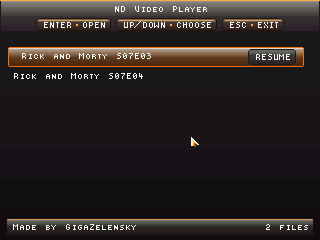
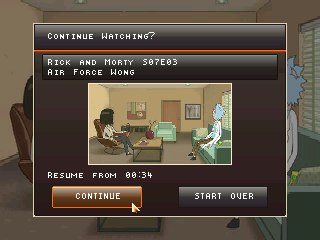
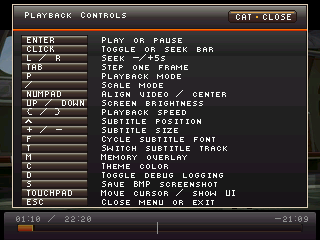
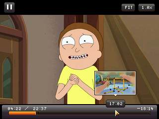
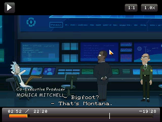
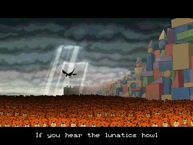

# Nspire-VideoPlayer-Ndless

Native Ndless video player and PC-side encoder for the TI-Nspire CX and CX II line.

This project targets the **TI-Nspire CX**, **TI-Nspire CX II**, and **TI-Nspire CX II-T**, and plays streamed `.nvp` movies from calculator storage. The player binary and the movie data stay separate:

- `ndvideo.tns`: the Ndless launcher
- `*.nvp.tns`: movie containers produced by the encoder

## Screenshots

| Main menu | Continue watching | Playback controls |
| --- | --- | --- |
|  |  |  |

| UI overlay | Dialogue scene | Subtitle playback |
| --- | --- | --- |
|  |  |  |

## Current Format

The `.nvp` format used by the current player is:

- H.264 Annex B video bitstream in legacy version 9/10 containers
- H.264 or MPEG-4 Part 2 video in version 11 codec-tagged containers
- chunked container with per-chunk frame tables
- optional text subtitle tracks stored in the container
- raw stored chunk payloads

## Features

- native C/Ndless runtime
- CX and CX II LCD paths through Ndless' native framebuffer modes
- streamed playback from calculator storage
- H.264 decode through `h264bsd`
- MPEG-4 Part 2 decode through vendored Xvid sources
- RGB565 output
- chunk-byte prefetching for smoother playback
- accurate frame pacing from a hardware-backed monotonic timer
- subtitle support for text subtitle tracks
- built-in subtitle font cycling
- scale modes: `FIT`, `FILL`, `STRETCH`, `1:1`
- playback speed control from `0.25x` to `2.0x`
- screen brightness control with `Up` / `Down` and an on-screen percentage overlay
- theme color profiles: `DORFic`, `Blue`, `Green`, and `Red`
- picker UI for multiple `.nvp` / `.nvp.tns` files
- picker filename metadata tooltips from bracketed tags
- resume history with saved playback, subtitle, and theme settings
- debug log output and in-player memory/playback overlay

## Current Limits

- no audio yet

## Battery Life

Battery Life: ~9.5 hours of continuous H.264 playback at 100% brightness on a CX II-T.

## Controls

### Picker

- `Up` / `Down` or keypad `8` / `2`: select movie
- touchpad: move cursor
- touchpad hover: after a short pause, show filename metadata tooltip when available
- touchpad click: open highlighted movie
- `Enter` or keypad `5`: open movie
- `C`: cycle theme color
- `S`: save a BMP screenshot
- `Scratchpad`: save state and open OS Scratchpad
- `Esc`: exit

### Movie Filename Metadata

The picker hides the full video extension and supports optional bracketed metadata in movie filenames.

Example:

```text
Rick and Morty S07E03 [English SDH].nvp.tns
```

The list row shows `Rick and Morty S07E03`. If you hover the row and keep the pointer still briefly, a small tooltip shows the clean title plus `English SDH` underneath. Multiple bracketed tags are joined with ` | ` in the tooltip.

### Playback

- `Space`: play / pause, or restart when the movie has ended
- touchpad: move cursor and show the UI
- `Enter` / keypad `5` / touchpad click: play / pause, restart at end, click hovered controls, or seek inside the bottom UI band
- `Left` / `Right` or keypad `4` / `6`: seek `-5s` / `+5s`
- keypad `7` / `9`: switch to the previous / next video in the current directory
- `Up` / `Down` or keypad `8` / `2`: increase / decrease screen brightness
- `Tab`: single-frame step while paused, hold to repeat
- `P`: cycle playback mode: `PLAY ONCE`, `REPLAY`, `AUTO NEXT`
- `R`: toggle realtime sync, allowing displayed-frame drops instead of slowdown
- `/`: cycle scale mode
- `Ctrl` + keypad `1`-`9`: align video
- `{` / `}`: decrease / increase playback speed
- `^`: cycle subtitle placement
- `+` / `-`: increase / decrease subtitle size, down to hidden
- `F`: cycle subtitle font
- `T`: cycle subtitle track
- `M`: toggle memory / playback diagnostics overlay
- `C`: cycle theme color
- `D`: toggle verbose debug logging
- `S`: save a BMP screenshot
- `Catalog`: open / close the help overlay
- `Scratchpad`: save state and open OS Scratchpad
- `Esc`: close help, or leave the movie if help is not open
- `On`: turn the display black; while black, `Esc` saves history and returns to the OS home menu

### Resume Prompt

- `Left` / `Right` or keypad `4` / `6`: choose `CONTINUE` or `START OVER`
- touchpad: move cursor
- touchpad click: activate the highlighted button
- `Enter` or keypad `5`: confirm the selected button
- `C`: cycle theme color
- `S`: save a BMP screenshot
- `Scratchpad`: save state and open OS Scratchpad
- `Esc`: cancel and return

## Subtitle Fonts

The built-in subtitle font cycle currently includes:

- `Tinytype`
- `VGA`
- `Thin`
- `Space`
- `Fantasy`

## Repository Layout

- [src/player](src/player): native player shell and playback/UI implementation
- [src/movie](src/movie): `.nvp` container format definitions
- [src/codecs](src/codecs): codec adapters and vendored MPEG-4/Xvid decoder sources
- [src/codecs/h264bsd](src/codecs/h264bsd): H.264 decoder sources
- [src/initfini.c](src/initfini.c): startup / shutdown glue
- [tools/encode_ndless_video.py](tools/encode_ndless_video.py): PC-side encoder
- [tools/pack_zehn.py](tools/pack_zehn.py): Zehn packer used by the build
- [examples/screenshots](examples/screenshots): README screenshot assets
- [examples](examples): packaged sample files for quick calculator-side testing
- [Makefile](Makefile): build entry point

## Build

If you just want to run the player on a calculator, you do not have to build it yourself. The latest GitHub Actions run uploads `ndvideo.tns` as an artifact in the repository's `Actions` tab.

### Requirements

- Ndless SDK
- ARM GCC toolchain available in `PATH`
- `make`
- `bash`
- `python`
- `pyelftools`

### Build Command

```bash
make
```

### Build Output

The build writes to [dist](dist):

- `ndvideo.tns`
- `ndvideo.elf`
- `ndvideo.zehn`

## Encoder

The encoder turns a normal video file into a streamed `.nvp.tns` movie. H.264 is still the default and writes legacy version 10 containers for compatibility. MPEG-4 Part 2 can be selected with `--codec mpeg4` and writes version 11 codec-tagged containers.

### Python Requirements

```bash
pip install imageio-ffmpeg numpy pillow
```

### Basic Example

```powershell
python .\tools\encode_ndless_video.py "C:\path\to\video.mp4" --output ".\dist\video.nvp.tns"
```

### MPEG-4 Part 2 Example

```powershell
python .\tools\encode_ndless_video.py "C:\path\to\video.mp4" --codec mpeg4 --output ".\dist\video-mpeg4.nvp.tns"
```

### Embedded Subtitles

```powershell
python .\tools\encode_ndless_video.py "C:\path\to\video.mkv" --subtitle embedded --output ".\dist\video.nvp.tns"
```

### Burn Subtitles Into Video

```powershell
python .\tools\encode_ndless_video.py "C:\path\to\video.mkv" --subtitle embedded --burn-subtitles --output ".\dist\video.nvp.tns"
```

### Burn Larger Subtitles Into Video

```powershell
python .\tools\encode_ndless_video.py "C:\path\to\video.mkv" --subtitle embedded --burn-subtitles --burn-subtitle-size 1.5 --output ".\dist\video.nvp.tns"
```

`--burn-subtitle-size` scales burned subtitles relative to the default output-safe size. It works for text subtitle burns and embedded bitmap subtitle burns.

### Write a Preview MP4

```powershell
python .\tools\encode_ndless_video.py "C:\path\to\video.mkv" --subtitle embedded --burn-subtitles --preview-mp4 --output ".\dist\video.nvp.tns"
```

`--preview-mp4` also writes a video-only `.preview.mp4` next to the `.nvp.tns` output so you can quickly inspect subtitle burn, framing, and quality on PC before copying the movie to the calculator.

### Preserve Source Framerate

```powershell
python .\tools\encode_ndless_video.py "C:\path\to\video.mkv" --subtitle embedded --fps source --output ".\dist\video.nvp.tns"
```

### Recommended Full-Episode Example

```powershell
python .\tools\encode_ndless_video.py "C:\path\to\video.mkv" --subtitle embedded --output ".\dist\video.nvp.tns" --fps 16 --max-width 320 --max-height 180 --max-chunk-kib 64 --stream-profile quality --crf 14.5 --preset veryslow --level 1.3
```

### Target A Specific Size With 2-Pass ABR

```powershell
python .\tools\encode_ndless_video.py "C:\path\to\video.mkv" --output ".\dist\video.nvp.tns" --fps 16 --max-width 320 --max-height 180 --max-chunk-kib 64 --idr-frames byte-auto --stream-profile quality --bitrate-kbps 140 --two-pass --preset veryslow --level 1.3
```

Use CRF when you want the best quality-per-bit without caring about the exact final size. Use `--bitrate-kbps ... --two-pass` when you need a tighter size target.
By default, chunks are packed by `--max-chunk-kib`; `64` is the recommended starting point for smooth on-device playback. `--chunk-frames` can still be set as an extra frame-count ceiling, and `--chunk-frames 0` leaves that ceiling disabled. `--idr-frames auto` is also the default; in bitrate mode it estimates a fixed keyframe cadence from the chunk byte cap. For higher-quality size-targeted encodes, `--idr-frames byte-auto` runs a probe encode, measures real frame sizes, then re-encodes with IDRs placed at measured chunk byte boundaries. This adds encode time, but avoids shrinking every GOP just because one scene is heavy. `--max-chunk-overshoot-percent` allows rare single-GOP near-misses above the target instead of throwing away an otherwise good encode.
When `--fps` caps or changes the framerate, the encoder timeline-samples frames and then verifies the encoded frame count against the intended duration. The `.json` sidecar records source fps, target fps, expected frames, actual frames, and drift in milliseconds.

### Main Encoder Options

- `--output`
- `--subtitle`
- `--burn-subtitles`
- `--burn-subtitle-size`
- `--subtitle-track`
- `--fps`
- `--max-width`
- `--max-height`
- `--active-aspect`
- `--crop`
- `--chunk-frames`
- `--idr-frames`
- `--max-chunk-kib`
- `--max-chunk-overshoot-percent`
- `--crf`
- `--bitrate-kbps`
- `--two-pass`
- `--preset`
- `--level`
- `--stream-profile`
- `--start`
- `--duration`
- `--timeline-drift-tolerance-ms`
- `--preview-mp4`
- `--quiet`

Run `python tools/encode_ndless_video.py --help` for the full CLI.

## Diagnostics

The player can write a debug log next to the movie file as `ndvideo-debug.log`.

The `M` overlay shows:

- total RAM usage
- cache usage
- current frame
- contiguous decoded runway
- decode target
- lag count
- ring-hit vs direct-decode counts
- whether verbose debug logging is currently enabled

Verbose debug logging is off by default. Press `D` during playback to enable it; normal playback exits do not write `ndvideo-debug.log` unless logging was enabled or the player hits an error.

The [examples](examples) folder also includes a short packaged sample movie and a matching `ndvideo.tns` for quick on-device smoke testing.

## Install On Calculator

1. Download `ndvideo.tns` from the latest GitHub Actions artifact, or build it locally.
2. Encode one or more videos into `.nvp.tns`.
3. Copy `ndvideo.tns` and the movie files to the calculator.
4. Launch `ndvideo.tns` through Ndless.
5. Pick a movie and play it locally from storage.

## License

Unless noted otherwise, the software in this repository is licensed under the GNU General Public License, version 3. See [LICENSE](LICENSE).
